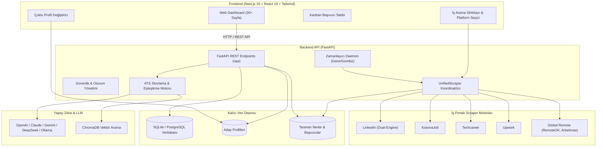

# 🚀 Otonom İş Bulma Sistemi (Autonomous Career Agent)

[](https://github.com/AlpC18/Automation4FindingJob/actions/workflows/ci.yml)
[](https://fastapi.tiangolo.com)
[](https://nextjs.org)
[](https://www.docker.com/)
[](LICENSE)

**Otonom İş Bulma Sistemi**, birden fazla iş platformundan (LinkedIn, KosovaJob, Upwork, Techcareer, Remote vb.) gerçek zamanlı iş ilanlarını tarayan, yapay zeka ile profilinize göre analiz eden, ATS skorları hesaplayan, CV ve ön yazı hazırlayan, STAR formatında mülakat provası yaptıran ve başvurularınızı otomatik yöneten **uçtan uca otonom kariyer platformudur.**

---

## 📑 İçindekiler
1. [Öne Çıkan Özellikler](#-öne-çıkan-özellikler)
2. [Sistem Mimarisi](#-sistem-mimarisi)
3. [Teknoloji Yığını](#-teknoloji-yığını)
4. [Hızlı Başlangıç (Docker ile)](#-hızlı-başlangıç-docker-ile)
5. [Manuel Kurulum (Yerel Geliştirme)](#-manuel-kurulum-yerel-geliştirme)
6. [Çevre Değişkenleri (.env)](#-çevre-değişkenleri)
7. [Testler ve Kod Kalitesi](#-testler-ve-kod-kalitesi)
8. [Proje Dizin Yapısı](#-proje-dizin-yapısı)
9. [Katkıda Bulunma](#-katkıda-bulunma)

---

## ✨ Öne Çıkan Özellikler

### 🔍 1. Çoklu Platform İş İlanı Tarama (Scraping)
- **LinkedIn Dual-Engine Scraper:** Hem Apify Actor hem de sıfır maliyetli ve engelsiz çalışan yerel public misafir feed motoru.
- **KosovaJob:** Kosova ve Balkan bölgesi için özel scraper entegrasyonu.
- **Techcareer, Upwork & Global Remote:** RemoteOK, Arbeitnow ve şirket kariyer sayfaları (Greenhouse, Lever, Ashby).
- **Esnek Platform Seçici:** Hangi platformlardan tarama yapılacağını arayüzden tek tıkla seçebilme.
- **Tıklanabilir Orijinal İlan Linkleri:** İş kartları ve detay modallarında doğrudan platform ilanına yönlendiren harici bağlantılar.

### 👥 2. Çoklu Aday Profili Yönetimi (Multi-Profile Switcher)
- Kendiniz, aile üyeleriniz veya arkadaşlarınız için bağımsız profiller oluşturabilme (örn. *Yazılım Mühendisi*, *İç Mimar*, *Grafik Tasarımcı*, *Ekonomist*).
- Tek tıkla aktif profil değiştirme; tüm ATS skorları, CV uyum analizleri ve aramalar seçili profile göre anında güncellenir.

### 🧠 3. Yapay Zeka & ATS Analizi
- **Akıllı ATS Skorlama:** İlan gereksinimleri ile aday becerilerini karşılaştırarak 0-100 arası uyum puanı üretir.
- **Eksik Yetenek Analizi:** İlanda istenen ancak profilinizde eksik olan teknolojileri tespit eder ve gelişim önerileri sunar.
- **Kişiye Özel CV ve Ön Yazı Üretimi:** Seçili ilan için anahtar kelimeleri optimize edilmiş PDF CV ve samimi ön yazı oluşturur.

### 📬 4. Başvuru Yönetimi & Doğrudan E-Posta
- **E-Posta ile Doğrudan Başvuru:** İlanda yer alan iletişim e-postasına sistem üzerinden özelleştirilmiş ön yazı ve CV ekiyle SMTP üzerinden doğrudan başvuru gönderme.
- **Kanban Takip Panosu:** Başvurularınızı *İnceleniyor*, *Başvuruldu*, *Mülakat*, *Teklif*, *Red* aşamalarında görsel olarak sürükle-bırak yöntemiyle yönetin.
- **Excel/CSV Export & WhatsApp Paylaşımı:** Taranan ilanları tek tıkla Türkçe Excel uyumlu CSV olarak indirme veya WhatsApp formatında özet metin kopyalama.

### 🎯 5. Mülakat Simülasyonu & Diğer Modüller (30+ Sayfa)
- **STAR Mülakat Provası:** Yapay zeka mülakatçısı ile sesli/yazılı teknik ve davranışsal soru-cevap pratiği.
- **Maaş İstihbaratı:** Pozisyona göre küresel ve yerel maaş aralığı tahminleri.
- **Kariyer Yol Haritası:** Hedeflediğiniz pozisyona ulaşmak için basamak basamak öğrenme planı.
- **Otonom Gece Daemon:** Gece belirlenen saatte otomatik iş arama, sabah adaya özet ve taslak başvuru sunma.
- **Gelen Kutusu (Inbox):** Şirketlerden gelen yanıtları ve mülakat davetlerini tek merkezden yönetme.

---

## 🏛️ Sistem Mimarisi



---

## 🛠️ Teknoloji Yığını

| Katman | Teknolojiler |
|---|---|
| **Backend** | Python 3.12+, FastAPI, Pydantic v2, Uvicorn, ReportLab, PyPDF |
| **Frontend** | Next.js 15.5 (App Router), React 19, TypeScript, Tailwind CSS, Lucide Icons |
| **Veritabanı** | SQLite (Geliştirme) / PostgreSQL + pgvector (Üretim), ChromaDB (Vektör arama) |
| **Yapay Zeka** | OpenAI (GPT-4o), Anthropic (Claude Sonnet 3.5), Google Gemini, DeepSeek, Yerel Ollama |
| **Scraping** | BeautifulSoup4, HTTPX, Urllib, Apify Entegrasyonu |
| **DevOps & Araçlar** | Docker, Docker Compose, GitHub Actions CI/CD, Pytest, Node Test Runner |

---

## 🐳 Hızlı Başlangıç (Docker ile)

Sistemi tüm bağımlılıklarıyla birlikte **tek komutla** ayağa kaldırmak için:

```bash
# 1. Depoyu klonlayın
git clone https://github.com/AlpC18/Automation4FindingJob.git
cd Automation4FindingJob

# 2. Örnek ortam değişkenlerini kopyalayın
cp .env.example .env

# 3. Docker Compose ile başlatın
docker-compose up -d --build
```

Konteynerlar hazır olduğunda:
- 🌐 **Web Arayüzü:** [http://localhost:3000](http://localhost:3000)
- 🔌 **Backend API & Swagger Dokümantasyonu:** [http://localhost:8000/docs](http://localhost:8000/docs)
- 📊 **Redis:** `localhost:6379`

---

## 💻 Manuel Kurulum (Yerel Geliştirme)

### Gereksinimler
- Python 3.12 veya üzeri
- Node.js 20 veya üzeri
- Git

### 1. Backend Kurulumu
```bash
# Sanal ortam oluşturun ve aktif edin
python3 -m venv backend/.venv
source backend/.venv/bin/activate  # Windows için: backend\.venv\Scripts\activate

# Bağımlılıkları yükleyin
pip install -r backend/requirements.txt

# Çevre değişkenlerini ayarlayın
cp .env.example .env

# Backend sunucusunu başlatın (Port: 18000 veya 8000)
python -m uvicorn backend.app.main:app --host 127.0.0.1 --port 18000 --reload
```

### 2. Frontend Kurulumu
```bash
# Yeni bir terminal sekmesinde frontend dizinine geçin
cd frontend

# Bağımlılıkları yükleyin
npm install

# Geliştirme sunucusunu başlatın (Port: 13000 veya 3000)
npm run dev -- -p 13000
```

Tarayıcınızdan `http://localhost:13000` adresine giderek sistemi kullanmaya başlayabilirsiniz.

---

## 🔑 Çevre Değişkenleri

Yapılandırma dosyası `.env.example` içinde detaylı açıklamalar yer almaktadır. Başlıca ayarlar:

| Değişken | Açıklama | Varsayılan |
|---|---|---|
| `API_PORT` | Backend dinleme portu | `18000` |
| `ENVIRONMENT` | Çalışma ortamı (`development` / `production`) | `development` |
| `DATABASE_URL` | Veritabanı adresi (SQLite veya PostgreSQL) | `sqlite:///backend/data/career_engine.db` |
| `OPENAI_API_KEY` | OpenAI API anahtarı (İsteğe bağlı) | Boş |
| `ANTHROPIC_API_KEY` | Claude API anahtarı (İsteğe bağlı) | Boş |
| `APIFY_API_TOKEN` | Apify Actor token (İsteğe bağlı) | Boş |
| `SMTP_HOST` & `SMTP_USER` | E-posta ile başvuru için e-posta bilgileri | Gmail / Outlook |

> **Not:** LLM anahtarları girilmediğinde sistem tamamen **kendi yerel kural ve eşleştirme motoruyla** kesintisiz çalışmaya devam eder.

---

## 🧪 Testler ve Kod Kalitesi

Tüm backend birim testlerini ve frontend testlerini tek komutla çalıştırmak için:

```bash
# Birleşik test çalıştırıcı
./scripts/run-tests.sh
```

Ayrı ayrı test çalıştırmak için:
```bash
# Backend pytest + kod kapsamı (coverage) raporu
./backend/.venv/bin/python -m pytest backend/tests/ -v --cov=backend/app --cov-report=term-missing

# Frontend birim ve güvenlik testleri
cd frontend && npm test

# Frontend TypeScript ve Build kontrolü
cd frontend && npm run build
```

---

## 📂 Proje Dizin Yapısı

```
Otonom İş Bulma Sistemi/
├── .github/
│   └── workflows/
│       ├── ci.yml                 # GitHub Actions test & build pipeline
│       └── docker-publish.yml     # GHCR Docker imaj yayınlama
├── backend/
│   ├── Dockerfile                 # Multi-stage Python backend imajı
│   ├── requirements.txt           # Python bağımlılıkları (pytest-cov dahil)
│   ├── tests/                     # Pytest birim ve entegrasyon testleri
│   │   ├── conftest.py
│   │   ├── test_config.py
│   │   ├── test_health.py
│   │   ├── test_profile.py
│   │   └── test_scrapers.py
│   └── app/
│       ├── main.py                # FastAPI ana sunucusu
│       ├── core/                  # DB, config, security, migration
│       ├── api/routers/           # 16 API router modülü
│       └── modules/
│           ├── scrape/            # 5 platform scraper motoru
│           ├── rank/              # ATS skor ve eşleştirme
│           ├── apply/             # CV, cover letter & başvuru
│           └── interview/         # STAR mülakat simülatörü
├── frontend/
│   ├── Dockerfile                 # Multi-stage Next.js frontend imajı
│   ├── package.json
│   ├── tests/                     # Frontend birim ve güvenlik testleri
│   └── src/
│       ├── app/                   # Next.js 15 App Router sayfaları (30+ sayfa)
│       ├── components/            # Yeniden kullanılabilir UI bileşenleri
│       └── lib/                   # API istemcisi, i18n çevirileri
├── scripts/
│   └── run-tests.sh               # Otomatik birleşik test betiği
├── docker-compose.yml             # Yerel Docker Compose ortamı
├── docker-compose.prod.yml        # Üretim Docker Compose yapılandırması
├── .env.example                   # Örnek çevre değişkenleri şablonu
├── pytest.ini                     # Pytest yapılandırması
├── .coveragerc                    # Kod kapsamı (coverage) yapılandırması
└── README.md                      # Proje dokümantasyonu
```

---

## 🤝 Katkıda Bulunma

1. Bu depoyu Fork edin (`fork`).
2. Özellik dalınızı oluşturun (`git checkout -b feature/YeniOzellik`).
3. Değişikliklerinizi commit edin (`git commit -m 'feat: Yeni özellik eklendi'`).
4. Dalınıza push edin (`git push origin feature/YeniOzellik`).
5. Bir **Pull Request** açın.

---

## 📄 Lisans

Bu proje [MIT Lisansı](LICENSE) kapsamında lisanslanmıştır.
